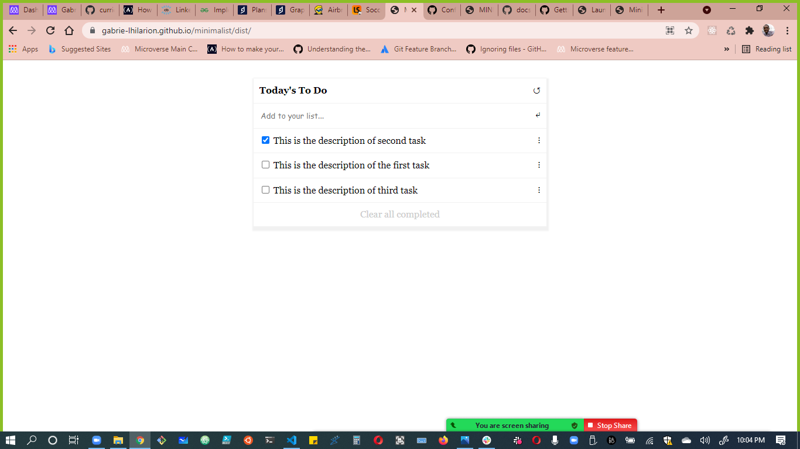

# MINIMALIST
In this project, I build a simple HTML list of To Do tasks.

## Built With

- HTML
- Javascript 
- WebPack

## Desktop Preview

## Getting Started

To get a local copy up and running follow these simple example steps.

### Download 
https://github.com/gabrie-lhilarion/minimalist.git
 
Follow this link to my GitHub repository. Copy the link from the code button
 
After you have copied the link, enter the command below in your terminal
 
git clone https://github.com/gabrie-lhilarion/minimalist.git

## Remember to paste the link after the git clone command 

## Author

👤 **Gabriel Hilarion**

- GitHub: [@githubhandle](https://github.com/gabrie-lhilarion)
- LinkedIn: [LinkedIn](https://www.linkedin.com/in/gabrielhilarion/)

## Online View

[Here](https://gabrie-lhilarion.github.io/minimalist/dist/) is a link to the online view of my website

## Show your support

Give a ⭐️ if you like this project!
